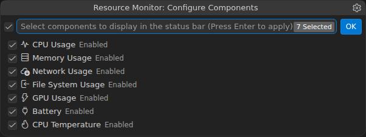
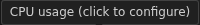

# resource-monitor

<div align="center">
  
  <br />
  <b>Resource Monitor for VS Code</b>
</div>

<br />

A simple resource monitor.
[Marketplace link.](https://marketplace.visualstudio.com/items?itemName=chneau.resource-monitor)


## Features

- CPU usage
- Memory usage
- Network usage (disabled by default)
- File system usage (disabled by default)
- GPU usage (disabled by default)
- Battery level (disabled by default)
- CPU temperature (disabled by default)

Clicking on any active metric in the status bar opens a quick menu allowing you
to toggle individual components on/off and quickly navigate to settings, and
hovering a metric shows its name:

 

You can also customize the order of monitors in settings or adjust the refresh
interval:


The network, file system, GPU, battery, and temperature metrics probe the system
more aggressively, so they are disabled by default. To enable them, use the
status bar menu or set their order to a value greater than 0 in settings.

## Regenerating the screenshots

The images in this README are captured by driving a real VS Code instance with
the extension loaded:

```sh
bun run screenshots
```

The script launches VS Code in an isolated profile with every metric enabled and
writes `images/bar.png`, `images/menu.png`, and `images/tooltip.png` (re-running
also refreshes `images/settings.png` if you capture it).

Requirements:

- A desktop VS Code build (`code`, `code-insiders`, or `codium`) reachable via
  `$VSCODE_BIN` or on `$PATH`. The `code` shim from a remote/vscode-server
  install is not a desktop app and will not work.
- On headless Linux the script starts its own `Xvfb` display; installing
  ImageMagick (`import`) lets it capture the native status bar tooltip that
  Chromium paints outside the page.
