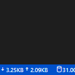
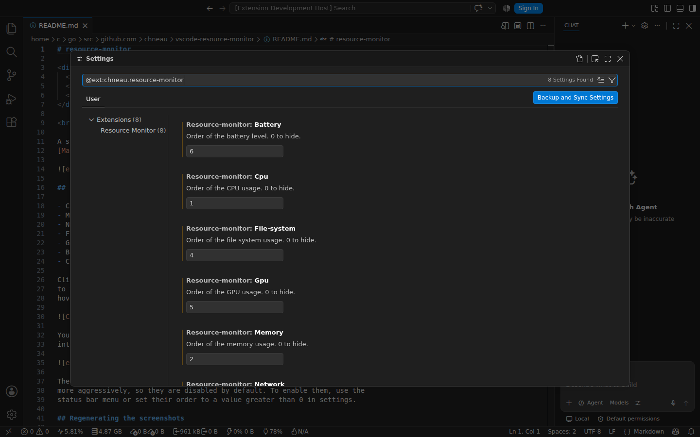

# resource-monitor

  
   
  <b>Resource Monitor for VS Code</b>

 

A simple resource monitor.
[Marketplace link.](https://marketplace.visualstudio.com/items?itemName=chneau.resource-monitor)

## Features

- CPU usage
- Memory usage
- Network usage (disabled by default)
- File system usage (disabled by default)
- GPU usage (disabled by default)
- Battery level (disabled by default)
- CPU temperature (disabled by default)

Clicking on any active metric in the status bar opens a quick menu allowing you
to toggle individual components on/off and quickly navigate to settings.

You can also customize the order of monitors in settings or adjust the refresh
interval:

The network, file system, GPU, battery, and temperature metrics probe the
system more aggressively, so they are disabled by default. To enable them, use
the status bar menu or set their order to a value greater than 0 in settings.
