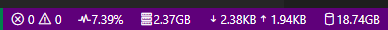

# resource-monitor

A simple resource monitor.
[Marketplace link.](https://marketplace.visualstudio.com/items?itemName=chneau.resource-monitor)

## Features

- CPU usage
- Memory usage
- Network usage
- File system usage
- GPU usage (disabled by default)

You can easily enable/disable or reorder the monitors in the settings as well as changing the update interval.

To enable GPU monitoring, go to settings and set `resource-monitor.gpu` to a
value greater than 0.
